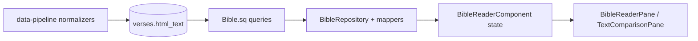

# Red-Letter Feature — Issue Report
> Auto-generated analysis of the Words of Jesus (Red Letter) feature

## Executive Summary
The current red-letter feature is present in UI controls but functionally broken end-to-end for normalized Bible data. The core blocker is that `html_text` is never populated by the two active Python normalizers, so the UI has no structured markup to style. Even when `htmlText` exists (module parsers), markup format is inconsistent (`wj` expectation vs raw OSIS). The UI currently applies red style to entire verses instead of partial spans, which is a UX/design gap. Severity is **critical overall** because the feature appears available but does not reliably work.

## Feature Flow Diagram

## Critical Issues

### ISSUE-RL-001: `html_text` Column Never Populated
- **Severity:** CRITICAL — Feature completely non-functional for seeded content
- **Affected files:**
  - `data-pipeline/normalizers/bible_text.py:170`
  - `data-pipeline/normalizers/beblia_xml.py:243`
  - `shared/src/commonMain/sqldelight/migrations/15.sqm:13`
- **Description:** Both primary normalizers always insert `NULL` into `html_text`, even though the DB schema supports it.
- **Evidence:**
  - `bible_text.py:170` inserts `... html_text) VALUES (?, ?, ?, ?, NULL)`
  - `beblia_xml.py:243` inserts `... html_text) VALUES (?, ?, ?, ?, NULL)`
  - Migration exists (`15.sqm:13`): `ALTER TABLE verses ADD COLUMN html_text TEXT;`

### ISSUE-RL-002: Tag Format Mismatch (USFM `wj` vs OSIS `<q who="Jesus">`)
- **Severity:** HIGH — Data present can still fail detection/rendering
- **Affected files:**
  - `composeApp/src/commonMain/kotlin/org/biblestudio/ui/panes/BibleReaderPane.kt:480`
  - `composeApp/src/commonMain/kotlin/org/biblestudio/ui/panes/BibleReaderPane.kt:632`
  - `shared/src/commonMain/kotlin/org/biblestudio/core/data_manager/parsers/OsisParser.kt:59`
  - `shared/src/commonMain/kotlin/org/biblestudio/core/data_manager/parsers/UsfmParser.kt:111`
- **Description:** UI red-letter detection is a string contains check for `"wj"`, while OSIS parser stores raw verse XML (`content.trim()`) and USFM parser does not set `htmlText` at all.
- **Evidence:**
  - UI checks: `verse.htmlText?.contains("wj") == true`
  - OSIS parser: `htmlText = content.trim()` (no normalization to canonical tags)
  - USFM parser `ParsedVerse(...)` omits `htmlText`

### ISSUE-RL-003: Whole-Verse Coloring Instead of Partial
- **Severity:** MEDIUM — Incorrect visual behavior
- **Affected files:**
  - `composeApp/src/commonMain/kotlin/org/biblestudio/ui/panes/BibleReaderPane.kt:480`
  - `composeApp/src/commonMain/kotlin/org/biblestudio/ui/panes/BibleReaderPane.kt:632`
  - `composeApp/src/commonMain/kotlin/org/biblestudio/ui/panes/BibleReaderPane.kt:734`
- **Description:** If a verse is flagged as Jesus words, the whole verse is painted red; no inline span parsing exists.
- **Evidence:** `isWordsOfJesus` boolean drives style decisions for entire chunks/words.

### ISSUE-RL-004: TextComparison Pane Missing `html_text`
- **Severity:** MEDIUM — Comparison view cannot support red-letter spans
- **Affected files:**
  - `shared/src/commonMain/sqldelight/org/biblestudio/database/Bible.sq:81`
  - `shared/src/commonMain/kotlin/org/biblestudio/features/bible_reader/data/repositories/TextComparisonRepositoryImpl.kt:13`
  - `shared/src/commonMain/kotlin/org/biblestudio/features/bible_reader/domain/entities/VersionComparison.kt:11`
- **Description:** Comparison query fetches only abbreviation + plain text; domain model stores only `Map<String, String>`.
- **Evidence:** `SELECT b.abbreviation, v.text` in `versesForComparisonByGlobalId`.

### ISSUE-RL-005: Per-Pane vs Global Toggle Edge Cases
- **Severity:** LOW — UX inconsistency when inheriting global setting
- **Affected files:**
  - `shared/src/commonMain/kotlin/org/biblestudio/features/bible_reader/component/BibleReaderComponent.kt:45`
  - `shared/src/commonMain/kotlin/org/biblestudio/features/bible_reader/component/DefaultBibleReaderComponent.kt:260`
  - `composeApp/src/commonMain/kotlin/org/biblestudio/App.kt:105`
  - `composeApp/src/commonMain/kotlin/org/biblestudio/ui/workspace/PaneContent.kt:174`
- **Description:** Per-pane `redLetter` is nullable (`null = inherit global`), but toggle uses `false` fallback; first toggle from inherited global `true` does not invert effective value.
- **Evidence:** `_state.update { it.copy(redLetter = !(it.redLetter ?: false)) }`.

### ISSUE-RL-006: BibleModuleHandler is a Stub
- **Severity:** HIGH — Downloaded bible modules won’t wire red-letter/import data
- **Affected files:**
  - `shared/src/commonMain/kotlin/org/biblestudio/core/data_manager/handlers/BibleModuleHandler.kt:20`
- **Description:** Installer logs progress only; actual parse + DB insert path is unimplemented.
- **Evidence:** Comment states parsing/insertion will be wired later; method ends after progress callbacks.

### ISSUE-RL-007: Zero Test Coverage for Red-Letter Rendering
- **Severity:** HIGH — regressions likely and behavior unverified
- **Affected tests:**
  - `shared/src/desktopTest/kotlin/org/biblestudio/features/bible_reader/component/DefaultBibleReaderComponentTest.kt:92`
  - `composeApp/src/desktopTest/kotlin/org/biblestudio/ui/panes/BibleReaderPaneTest.kt:48`
  - `composeApp/src/desktopTest/kotlin/org/biblestudio/ui/panes/BibleReaderPaneTest.kt:108`
- **Description:** Existing tests cover toggles and generic rendering but not `<wj>` span parsing, red span style, or comparison red-letter behavior.

## Inconsistency Matrix

| Component | Expected Behavior | Actual Behavior | Gap |
|---|---|---|---|
| Pipeline normalizers | Populate `html_text` when source provides red-letter data | Always write `NULL` | Data gap blocks feature |
| OSIS parser | Normalize to canonical internal red-letter markup | Stores raw XML snippet | Markup mismatch |
| USFM parser | Populate `htmlText` from `\\wj ... \\wj*` | Does not set `htmlText` | Missing data path |
| BibleReader UI | Color only Jesus-word spans | Colors full verse based on boolean | Rendering granularity issue |
| TextComparison | Carry plain + html text | Plain text only | No red-letter in comparison |
| Toggle logic | Invert effective (inherited/global) value | Inverts nullable with `false` default | UX edge case |
| Module handler | Parse and persist module verses | Stub implementation | Import path incomplete |

## Impact Assessment
- **Who is affected:** all users enabling red-letter in normal seeded builds.
- **UX impact:** toggle appears available but typically has no visible effect; if data exists, styling is coarse (whole verse red).
- **Functional impact:** no robust red-letter behavior in comparison view, and module import path does not complete the pipeline.

## Recommended Priority Order
1. ISSUE-RL-001 — populate/propagate `html_text`
2. ISSUE-RL-002 — normalize canonical markup (`<wj>...</wj>`)
3. ISSUE-RL-003 — partial-span rendering in BibleReader
4. ISSUE-RL-005 — per-pane toggle uses effective/global value
5. ISSUE-RL-004 — TextComparison `html_text` pass-through
6. ISSUE-RL-007 — tests for parser + rendering + toggle
7. ISSUE-RL-006 — module handler wiring (larger scope/epic)
